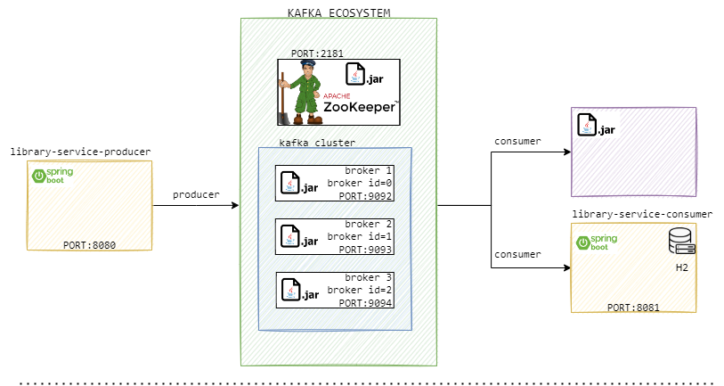

# Kafka tutorials

[Reference #1](https://www.udemy.com/course/spring-boot-microservices-and-spring-cloud/)  
[Reference #2](https://www.udemy.com/course/kafka-fundamentals-for-java-developers/)  
[Reference #2](https://stackoverflow.com/questions/38024514/understanding-kafka-topics-and-partitions)  


### Architecture



### Terminologies


<details>
<summary><b>Record</b></summary>
A record (also called a message) is the basic unit of data in Kafka. A record typically contains a key (optional), a value (payload), headers (optional metadata), and a timestamp. Records are written to partitions and stored at a specific offset. In the Java client you create a ProducerRecord to send data; consumers receive ConsumerRecord objects that include metadata (topic, partition, offset, timestamp) along with the key and value.
</details>

<details>
<summary><b>Topic</b></summary>
A topic is a named, logical stream of records in Kafka (Think DB table). Producers publish records to a topic and consumers read from a topic. Topics are multi-subscriber: multiple consumer groups can read the same topic independently. Ordering is only guaranteed within a single partition of a topic, not across the whole topic. Use a message key to send related messages to the same partition when you need ordering.
</details>

<details>
<summary><b>Partition</b></summary>
A partition is an ordered, immutable sequence of records within a topic (a commit log). Partitions provide parallelism and ordering: records are strictly ordered only inside a partition and are addressed by a monotonically increasing offset. When creating a topic you choose the number of partitions and the replication factor. Kafka distributes a topic's partitions across the brokers in the cluster to scale throughput and availability.
</details>

<details>
<summary><b>Brokers</b></summary>
- A Kafka broker is a single Kafka server that stores data (partitions) and serves client requests (producers and consumers).
- Brokers form a Kafka cluster and are identified by a unique broker id (integer).
- Partitions for topics are distributed across brokers; this distribution provides load balancing and horizontal scalability.
- One broker in the cluster acts as the controller to manage cluster metadata and orchestrate leader election for partitions.
- After connecting to any bootstrap broker you can discover and interact with the entire cluster.

How brokers and topics relate (example):
- Topic-A with three partitions can have those partitions spread across Broker-101, Broker-102 and Broker-103.
- Topic-B with two partitions may have its partitions on Broker-101 and Broker-102. Broker-103 may not hold Topic-B partitions in this example.
- This distribution is intentional: each broker stores the partitions assigned to it (and their replicas), not all topic data.

[Further reading](https://www.confluent.io/blog/introducing-kafka/)
</details>


<details>
<summary><b>Migrating from Zookeeper to KRaft</b></summary>

- KRaft (Kafka Raft) mode is a new way of running Apache Kafka without the need for an external ZooKeeper cluster. KRaft mode uses an internal consensus protocol based on the Raft algorithm to manage metadata and coordinate brokers in the Kafka cluster.
- KRaft mode simplifies Kafka deployment and management by eliminating the need for a separate ZooKeeper cluster. It also improves scalability and fault tolerance by allowing Kafka brokers to manage their own metadata and coordinate directly with each other.
- KRaft mode is available in Apache Kafka 2.8.0 and later versions. To use KRaft mode, you need to configure your Kafka brokers to run in KRaft mode and set up a KRaft controller quorum.
- KRaft mode is still a relatively new feature in Apache Kafka, and it may not be suitable for all use cases. It is recommended to carefully evaluate the benefits and drawbacks of KRaft mode before migrating from ZooKeeper to KRaft.

[Further reading](https://medium.com/@youssefali6212/apache-kafka-study-notes-3-zookeeper-vs-kraft-8eb683a8f6aa)


</details>

<details>
<summary><b>Consumer group</b></summary>

- Consumer group is a bunch of consumers that form a group in order to cooperate and consume messages from a set of topics.  
- Consumer groups are formed when you have multiple instances of the same application.
- Consumer groups are the foundation for scalable message consumption.

Example: 
If two consumers have subscribed to the same topic and are present in the same consumer group, then these two consumers would be assigned a different set of partitions and none of these two consumers would receive the same messages.


Example 2:

5 consumers in the consumer group which is more than the number of partitions of the TopicT1, then every consumer would be assigned a single partition and the remaining consumer (Consumer5) would be left idle


[Further reading](https://medium.com/javarevisited/kafka-partitions-and-consumer-groups-in-6-mins-9e0e336c6c00)

</details>

<details>
<summary><b>Replication Factor & In-Sync Replicas</b></summary>

`Replication-factor` is the total number of copies of the data stored in an Apache Kafka cluster. Replication factor 1 means each record lives on one broker only.  

`min. insync. replicas` is the minimum number of copies of the data that you are willing to have online at any time to continue running and accepting new incoming messages.

Example 1. Replication factor 3. min.insync.replicas 2. 2 copies must be in sync to accept writes. 1 broker can afford fail.  
</details><br>

`Consumer groups`
Kafka has the concept of consumer groups where several consumers are grouped to consume a given topic. Consumers in the same consumer group are assigned the same group-id value.

The consumer group concept ensures that a message is only ever read by a single consumer in the group.

When a consumer group consumes the partitions of a topic, Kafka makes sure that each partition is consumed by exactly one consumer in the group


### Setting up kafka

<details>
<summary>Click to expand</summary><br>

1. Download Kafka BINARY file from `https://kafka.apache.org/downloads`
2. If you are using Windows, use cmd and run `tar -xvzf kafka-3.3.1-src.tgz`
3. Rename the folder to shorter name (for Windows)
4. List of command can be
   found [HERE](https://github.com/dilipsundarraj1/kafka-for-developers-using-spring-boot/blob/master/SetUpKafka.md)

</details>

### Zookeeper & Broker

`Zookeeper` - Acts a Kafka cluster coordinator that manages cluster membership of brokers, producers, and consumers
participating in message transfers via Kafka. It also helps in leader election for a Kafka topic.

`Broker` - A single Kafka server is called a Kafka Broker. A Kafka broker allows consumers to fetch messages by topic,
partition and offset. Kafka brokers can create a Kafka cluster by sharing information between each other directly or
indirectly using Zookeeper. A Kafka cluster has exactly one broker that acts as the Controller.

### Start Zookeeper & Broker

<details>
<summary>Click to expand</summary><br>

1. Start up the Zookeeper. in bin/windows run:

    zookeeper-server-start.bat ..\..\config\zookeeper.properties

Start up the Kafka Broker. We will run THREE brokers based on our own server properties

2. Copy server.properties in /config & rename as follows
3. Add/change this properties

    `server-1.properties`
    broker.id=0
    listeners=PLAINTEXT://localhost:9092
    auto.create.topics.enable=false
    log.dirs=/tmp/kafka-logs-1

    `server-2.properties`
    broker.id=1
    listeners=PLAINTEXT://localhost:9093
    auto.create.topics.enable=false
    log.dirs=/tmp/kafka-logs-2

    `server-3.properties`
    broker.id=2
    listeners=PLAINTEXT://localhost:9094
    auto.create.topics.enable=false
    log.dirs=/tmp/kafka-logs-3

4. In bin/windows folder run this to start brokers:

    kafka-server-start.bat ..\..\config\server-1.properties
    kafka-server-start.bat ..\..\config\server-2.properties
    kafka-server-start.bat ..\..\config\server-3.properties

</details>

### Set up producer in Spring Boot

<details>
<summary>Click to expand</summary><br>

1. Create endpoint
2. Create topic - library-events

</details>

### Start up consumer using jar

<details>
<summary>Click to expand</summary><br>

In bin/windows folder run this to start consumer:  
Without key:

    kafka-console-producer.bat --bootstrap-server localhost:9092 --topic library-events

</details>

### Sent your first message thru Spring Boot producer!

<details>
<summary>Click to expand</summary><br>

POST `http://localhost:8080/v1/libraryevent`

    {
        "libraryEventId":null,
        "book":{
            "bookId":2,
            "bookName":"abc",
            "bookAuthor":"zzzfff"
        }
    }
Postman collections: [Click here](./library-service-producer/src/main/resources/kafka-tutorials.postman_collection.json)
</details>

You should be able to receive message from your consumer console. Note that there are 2 diff methods

    sendNewEventWithDefaultTopic()

This is the default method for sending event. The method sendEevent() doesn't require to insert topic name as the argument as it will follow the one in application property file. Also, it doesn't use key to send message which means Kafka doesn't guarantee ordering of events

    sendNewEventWithDefinedTopic()

This uses the send() method which require to insert topic name as the argument. Also it uses key to send message. If we have a key, the message will be sent through the same partition. This is really important for the ordering of the events because Kafka guarantees ordering only at the partition level. To see the difference, see which partition is used in the logs. those with key will be using the same partition.

### Create Spring boot consumer

There are 3 main things we need to configure

- key-serializer
- value-deserializer
- group-id

### What is Rebalance?

<details>
<summary>Click to expand</summary><br>
Rebalance is the re-assignment of partition ownership among consumers within a given consumer group. Remember that every consumer in a consumer group is assigned one or more topic partitions exclusively.

A Rebalance happens when:

- a consumer JOINS the group
- a consumer SHUTS DOWN cleanly
- a consumer is considered DEAD by the group coordinator. This may happen after a crash or when the consumer is busy with
a long-running processing, which means that no heartbeats has been sent in the meanwhile by the consumer to the group
coordinator within the configured session interval
- new partitions are added  

Being a group coordinator (one of the brokers in the cluster) and a group leader (the first consumer that joins a group)
designated for a consumer group, Rebalance can be more or less described as follows:

- the leader receives a list of all consumers in the group from the group coordinator (this will include all consumers
that sent a heartbeat recently and which are therefore considered alive) and is responsible for assigning a subset of
partitions to each consumer.
- After deciding on the partition assignment (Kafka has a couple built-in partition assignment policies), the group leader
sends the list of assignments to the group coordinator, which sends this information to all the consumers.

[More info](https://stackoverflow.com/questions/30988002/what-does-rebalancing-mean-in-apache-kafka-context)
</details>

### Hands-on Rebalance
<details>
<summary>Click to expand</summary><br>
Create 2 instance of the same consumer service, start the app and check the logs of the assigned partition.

2 things will happen:

the 1st instance will show (part of)

    Revoke previously assigned partitions
    protocol='range'
    Adding newly assigned partitions: library-events-1, library-events-0
the 2nd instance will show

    Adding newly assigned partitions: library-events-2

Since we have 3 brokers running, it will be distributed among the 2 instances.

</details>

### Tools used for visualizing kafka topics, events, and consumer groups
<details>
<summary>Click to expand</summary><br>

[Reference](https://www.reddit.com/r/apachekafka/comments/1dcet0g/what_tools_do_you_use_for_visualizing_kafka/)  

- Kafka Tool (http://www.kafkatool.com/) - A GUI application for managing and using Apache Kafka clusters. It provides an easy-to-use interface for browsing Kafka topics, partitions, and messages.

- Kafbat (https://kafbat.io/) - A web-based Kafka management and monitoring tool. It allows users to view topics, partitions, and messages, as well as monitor consumer groups and offsets. Kafbat UI makes your kafka data flows observable, simplifies troubleshooting, and helps optimize performance—all in a lightweight dashboard.

Run docker command:
```bash
    docker run -it -p 8080:8080 -e DYNAMIC_CONFIG_ENABLED=true ghcr.io/kafbat/kafka-ui
```

- Conduktor (https://www.conduktor.io/) - A desktop application for managing and monitoring Apache Kafka clusters. It provides a user-friendly interface for browsing topics, partitions, and messages, as well as monitoring consumer groups and offsets.

- Kpow (https://factorhouse.io/kpow/) - A web-based Kafka monitoring and management tool. It allows users to view topics, partitions, and messages, as well as monitor consumer groups and offsets. Kpow provides real-time metrics and alerts for Kafka clusters.

</details>
